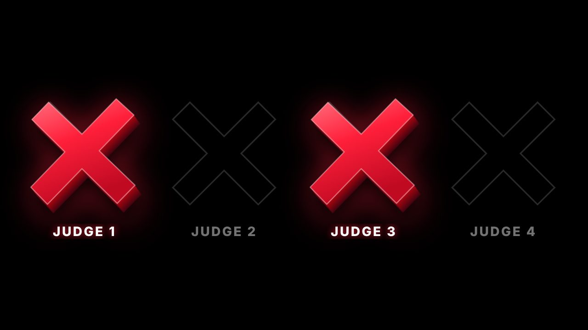
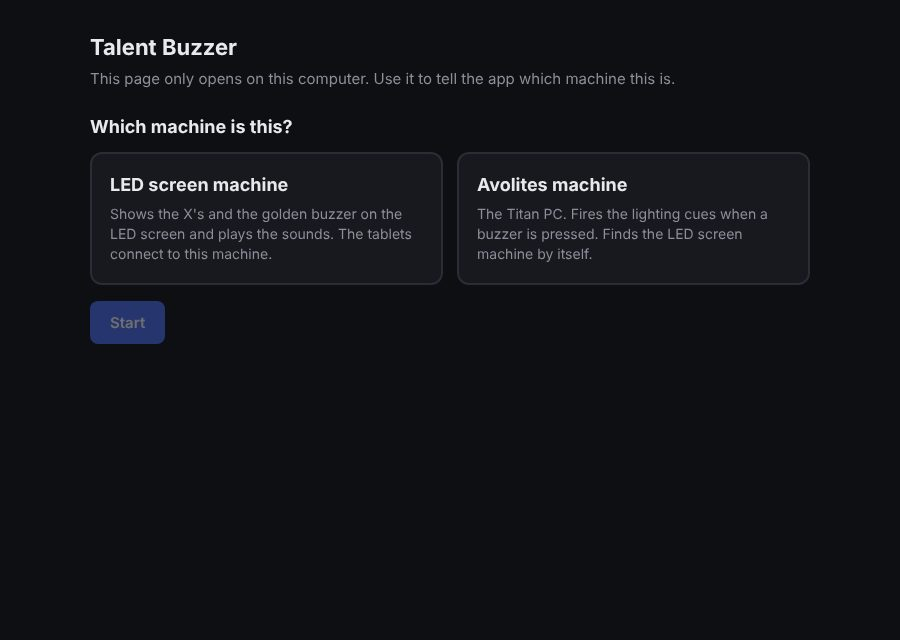
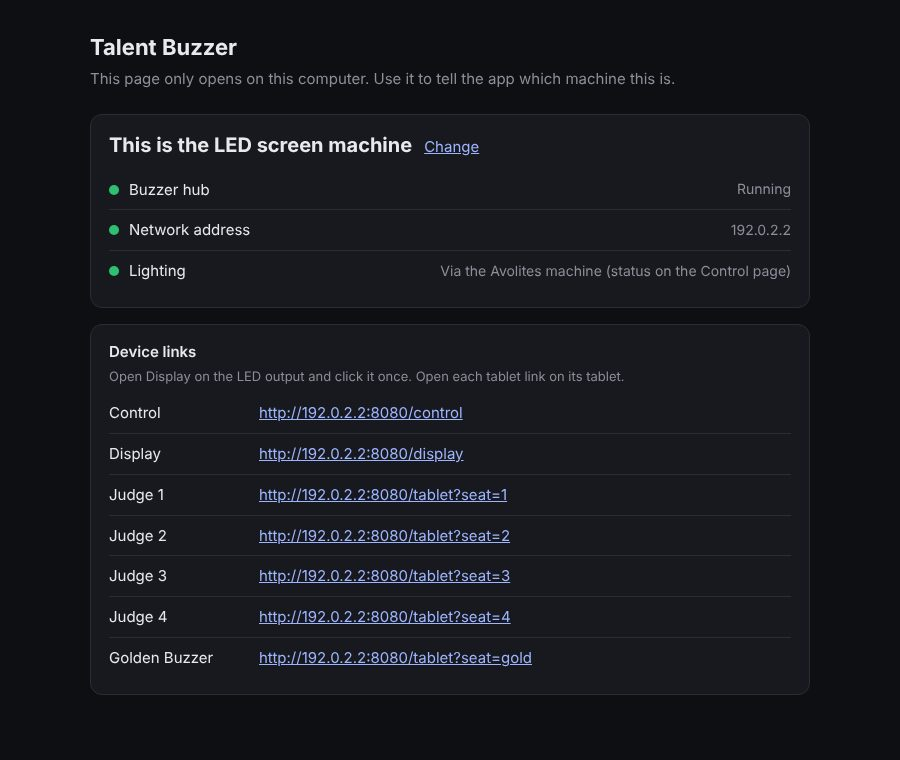
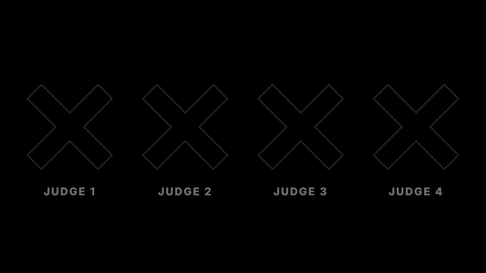
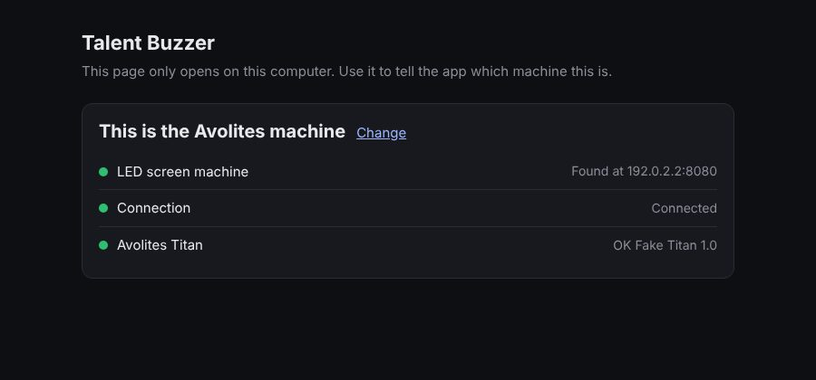
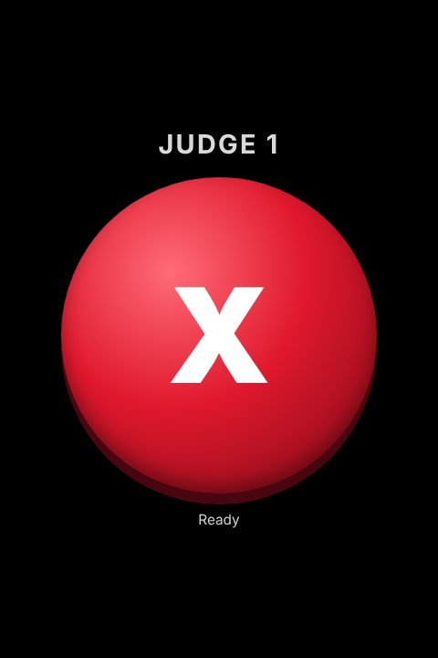
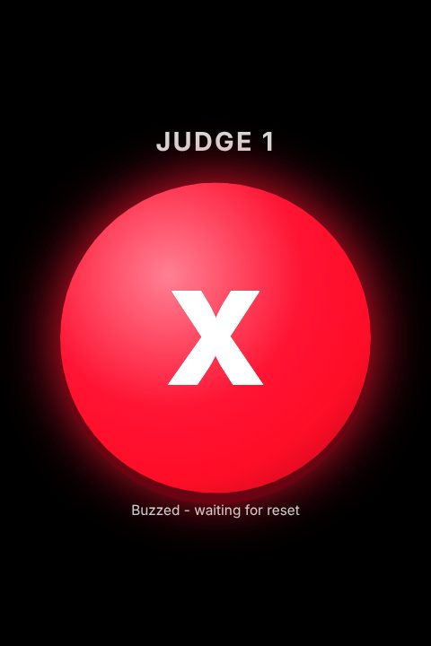
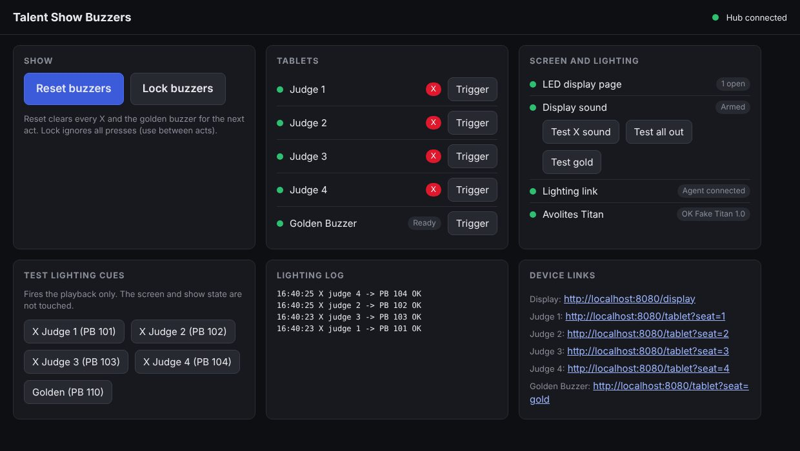
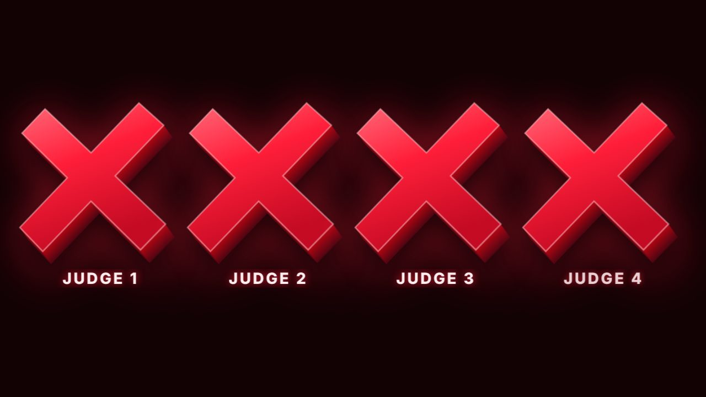

# Talent Show Buzzers

Judges press a buzzer on a tablet, and three things happen at once:

1. A big red **X** pops up on the LED screen above that judge's name.
2. A **buzzer sound** plays through the speakers.
3. The **stage lights** change.

There is also one **golden buzzer**. When it's pressed, the whole screen turns gold, gold confetti
falls, a fanfare plays, and the lights do something special.

If **all four judges** buzz, the screen flashes red and an alarm sounds.



---

## How it fits together

```
   4 red tablets  ─┐
                   ├── Wi-Fi ──>  LED SCREEN COMPUTER  ──>  big screen + speakers
   1 gold tablet  ─┘                    │
                                        └── network ──>  AVOLITES COMPUTER  ──>  stage lights
```

- The **tablets** are the buttons.
- The **LED screen computer** is the brain. It shows the X's and plays the sounds.
- The **Avolites computer** (the lighting desk computer) changes the lights when the brain tells it to.

You put the **same app** on both computers. When it starts, it asks which computer it's on.

---

## What you need

Tick these off before you start:

- [ ] The **LED screen computer** (Windows), plugged into the big screen and the speakers
- [ ] The **Avolites computer** (Windows, running Titan)
- [ ] **5 Android tablets**, charged, with their chargers
- [ ] All of them on the **same Wi-Fi / network**
- [ ] The **`talent-buzzer` folder** (see Part 1, step 2)
- [ ] **Internet** on both computers for the first setup (only needed once)
- [ ] About **30 minutes**, plus 5 minutes with whoever runs the lights

> **Tip:** Do the setup the day before the show, not five minutes before doors open.

---

## Part 1: Set up the LED screen computer

Do this on the computer that is plugged into the big LED screen.

**1. Install Node.js** (the engine the app runs on)

1. Open a web browser and go to **https://nodejs.org**
2. Click the big green button that says **LTS**. A file downloads.
3. Open the downloaded file. Click **Next**, **Next**, **Next**, then **Install**, then **Finish**.
   You don't need to change anything.

**2. Get the `talent-buzzer` folder**

1. Go to the church code on GitHub. Click the green **Code** button, then **Download ZIP**.
   (If you can't see it, ask whoever looks after the church website code to send you the folder.)
2. Find the ZIP in your Downloads. Right-click it and choose **Extract All**, then **Extract**.
3. Open the new folder, then **apps**. Inside is a folder called **`talent-buzzer`**.
4. Copy the **`talent-buzzer`** folder to the **Desktop**.

**3. Start the app**

1. Open the `talent-buzzer` folder on the Desktop.
2. Double-click **`start.bat`**.
   - If a blue box says *"Windows protected your PC"*, click **More info**, then **Run anyway**.
3. A black window opens. The first time, it downloads a few bits, which needs internet.
   **Leave this black window open**, because closing it stops the buzzers.
4. If a box says *"Windows Defender Firewall has blocked some features"*:
   tick **Private networks**, then click **Allow access**.
   This is important: without it the tablets can't connect.

**4. Tell it which computer this is**

A page opens in the web browser by itself:



1. Click **LED screen machine**.
2. Click **Start**.

**You should see** green dots and a list of **Device links**:



Keep this page open. You'll need these links for the screen, the tablets and the control page.

> **Next time**, just double-click `start.bat`. It remembers that this is the LED screen computer.

---

## Part 2: Put the X's on the big screen

On the LED screen computer:

1. On the setup page, click the **Display** link. It opens in a new tab.
2. Drag that browser window onto the **big LED screen**.
3. **Click once anywhere on it.** This switches the sound on, because browsers won't play sound
   until you click.
4. Press **F11** on the keyboard so it fills the whole screen.

**You should see** four faint X outlines with the judges' names underneath:



---

## Part 3: Set up the Avolites computer

On the lighting computer (the one running Titan):

1. **Check the lighting desk can be controlled.** Open a web browser and type this into the address bar exactly:

   ```
   http://localhost:4430/titan/get/System/SoftwareVersion
   ```

   **You should see** a version number, like `"15.0"`. If you see an error, ask the lighting person
   to make sure Titan is open and running.
2. Do **Part 1, steps 1–3** on this computer too (install Node.js, copy the folder, double-click `start.bat`,
   allow the firewall with **Private networks** ticked).
3. When the setup page opens, click **Avolites machine**, then **Start**.
   Leave the boxes empty, because it finds the LED screen computer by itself.

**You should see** three green dots:



| Dot | What it means |
| --- | --- |
| LED screen machine: **Found** | It found the LED screen computer on the network |
| Connection: **Connected** | The two computers are talking |
| Avolites Titan: **OK** | It can control the lights |

---

## Part 4: Set up the 5 tablets

Do this on **each** tablet.

1. Connect the tablet to the **same Wi-Fi** as the computers.
2. Open **Chrome**.
3. Type the tablet's link into the address bar. Copy it **exactly** from the **Device links** list on the
   LED screen computer, for example:

   | Tablet | Link (yours will have different numbers) |
   | --- | --- |
   | Judge 1 | `http://192.168.1.50:8080/tablet?seat=1` |
   | Judge 2 | `http://192.168.1.50:8080/tablet?seat=2` |
   | Judge 3 | `http://192.168.1.50:8080/tablet?seat=3` |
   | Judge 4 | `http://192.168.1.50:8080/tablet?seat=4` |
   | Golden | `http://192.168.1.50:8080/tablet?seat=gold` |

   > **Shortcut:** type just `http://192.168.1.50:8080/tablet` (with your numbers) and tap the judge's name from the list.

4. Tap the **⋮** menu (top right), then **Add to Home screen**, then **Add**.
   Close Chrome and open the new icon. Now there's no address bar in the way.
5. **Stop the screen going to sleep:** Settings → Display → **Screen timeout** → pick the longest time.
6. *(Optional)* **Pin the screen** so judges can't leave the buzzer by accident:
   Settings → Security → **App pinning** → On.

**You should see** a big button with **Ready** underneath:

| Red judge tablet | Golden tablet | After pressing |
| --- | --- | --- |
|  |  |  |

> **Stick a label on the back of each tablet** ("Judge 1", "Judge 2", ... "GOLDEN") so they don't get mixed up.

---

## Part 5: Ask the lighting person

The lighting person needs to make the "looks" for each buzzer. Show them this part.

> **For the lighting person:** record each look as a **playback** in Titan and give it a **user number**.
> When a buzzer is pressed, the app fires that playback at full, as if you'd pressed it. You can still
> take over by hand. When **Reset** is pressed, the app turns those playbacks off again.

| Look | Example user number |
| --- | --- |
| Judge 1 buzzes | 101 |
| Judge 2 buzzes | 102 |
| Judge 3 buzzes | 103 |
| Judge 4 buzzes | 104 |
| All four have buzzed (e.g. red strobe), optional | 120 |
| Golden buzzer | 110 |

If they use **different numbers**, change them on the **LED screen computer**:

1. In the `talent-buzzer` folder, copy **`config.example.json`** and paste it.
   Rename the copy to **`config.json`**.
2. Right-click `config.json` → **Open with** → **Notepad**.
3. Find this part and change **only the numbers**:

   ```json
   "cues": {
     "x": { "1": 101, "2": 102, "3": 103, "4": 104 },
     "golden": 110,
     "allX": null,
   ```

   - To use an "all four" look, change `null` to its number, e.g. `"allX": 120,`
   - Near the top you can change the judges' names too: `{ "seat": "1", "name": "Pastor Dave" }`
4. **Save** (Ctrl + S) and close Notepad.
5. Close the black `start.bat` window and double-click `start.bat` again.

> **Careful:** keep every `"`, `:` and `,` exactly where it is. Only change the numbers and names.
> If the app won't start after editing, delete `config.json` and try again.

---

## Part 6: Test everything (5 minutes)

On the LED screen computer, click the **Control** link on the setup page. This is the operator's page.
You can also open it on a laptop or phone that's on the same Wi-Fi.



Go through this list:

1. [ ] **Tablets:** five green dots. (A red dot means that tablet isn't connected.)
2. [ ] **LED display page:** green. **Display sound** says **Armed**.
   If it says *"Click the display page once"*, click the big screen.
3. [ ] **Lighting link** and **Avolites Titan:** both green.
4. [ ] Click **Test X sound**, **Test all out** and **Test gold**. You hear them through the speakers.
5. [ ] Click each **Test lighting cue** button. The right look comes up each time.
6. [ ] Press each tablet once. Check the X appears, the sound plays and the lights change.
7. [ ] Click **Reset buzzers**.
8. [ ] Click **Lock buzzers** until the first act starts.

All done? **You're ready for the show!**

---

## During the show

| Button (on the control page) | What it does |
| --- | --- |
| **Reset buzzers** | Clears all the X's and the gold screen, and turns the buzzer lights off. **Press it between every act.** |
| **Lock buzzers** | Tablets stop working until you press **Unlock**. Use it between acts so nobody presses by accident. |
| **Trigger** | Presses that judge's buzzer for them, in case a tablet dies. |

What the audience sees:

| What happens | On the screen |
| --- | --- |
| A judge buzzes | Their X pops out of the screen with a buzz. It stays until Reset. Pressing again does nothing. |
| All four judges buzz | The screen flashes red with an alarm, then glows red until Reset. |
| Golden buzzer | Gold screen, falling confetti, fanfare. Works once until Reset. |




**The order for each act:**
1. **Unlock** buzzers when the act starts.
2. Judges buzz (or not!).
3. **Reset**, then **Lock** when the act finishes.

---

## Uh oh! Something's wrong

| Problem | Try this |
| --- | --- |
| Tablet says **"Not connected - reconnecting..."** | Is the tablet on the same Wi-Fi as the computers? Is the black `start.bat` window still open on the LED screen computer? Is the link typed exactly right? |
| **No tablets can connect at all** | On the LED screen computer, Windows Firewall is probably blocking it. Search the Start menu for **"Allow an app through Windows Firewall"**, find **Node.js**, and tick **Private**. |
| **No sound** | Click once on the big screen. Check the computer's volume and that sound goes to the right speakers. Use **Test X sound** on the control page. |
| **Avolites page stuck on "Looking on the network..."** | Both computers must be on the same network. Allow Node.js through the firewall (see above) on the **Avolites** computer too. Or click **Change**, type the LED screen computer's address (shown as **Network address** on its setup page), then **Start**. |
| **Avolites Titan: Not reachable** | Titan isn't open, or step 1 of Part 3 didn't work. Ask the lighting person. |
| **Lights don't change but the screen does** | Look at the **Lighting log** on the control page. It says what went wrong. |
| **The wrong light look comes up** | The numbers in `config.json` don't match Titan. See Part 5. |
| **The big screen went back to a small window** | Click it and press **F11** again. |
| **Something is really stuck** | Close the black `start.bat` window and double-click `start.bat` again. The tablets and the screen reconnect by themselves within a few seconds. |
| **"Wrong access key"** | Someone set a key in `config.json`. See "For techies". |

---

## Words you might not know

| Word | What it means |
| --- | --- |
| **Node.js** | Free software the app needs to run, a bit like an engine. |
| **`start.bat`** | The file you double-click to start the app. |
| **Setup page** | The page that opens in the browser when the app starts. It only works on that computer. |
| **Control page** | The operator's page with Reset, Lock and all the test buttons. |
| **Display page** | The page that goes on the big screen. |
| **Network address / IP address** | The computer's "house number" on the network, like `192.168.1.50`. |
| **Titan** | The Avolites lighting software. |
| **Playback** | A saved lighting look in Titan. |
| **User number** | The number Titan gives each playback. The app uses it to pick the look. |
| **Firewall** | Windows' security guard that decides which apps can talk over the network. |
| **F11** | The keyboard key that makes a browser fill the whole screen. |

---

## For techies

### How it works

- `start.bat` runs `app.js`. That serves the **setup page** on `http://localhost:8090` (only this machine, Host-header checked).
  The chosen role is saved in `machine.json`, and the app runs `hub/server.js` (LED screen) or
  `agent/avolites-agent.js` (Avolites) as a child process, restarting it if it crashes.
- The **hub** serves the tablet, display and control pages on port **8080** and talks to them over WebSockets (`/ws`).
  It sends a UDP broadcast on port **8099** every 2 seconds (`lib/discovery.js`, no key inside) so the Avolites agent can find it.
- The **agent** connects *out* to the hub and fires playbacks with Titan's built-in Web API on the same PC:
  `http://localhost:4430/titan/script/2/Playbacks/FirePlaybackAtLevel?handle_userNumber=<N>&level_level=1&alwaysRefire=true`.
  On reset it calls `.../Playbacks/KillPlayback?handle_userNumber=<N>`. These URLs are templates in `config.json`
  (`titan.*`), so they can be changed without code if a Titan version names things differently.
  **They haven't been tested on a real console yet, so check them during your first rehearsal.**
- Everything runs on the local network. No internet or accounts are needed once `npm install` has run.

### Show rules

- Each judge's X latches until Reset; re-presses are ignored, and presses within `debounceMs` are ignored too.
- When all four judges have buzzed, an `all-x` event goes out and the optional `cues.allX` playback fires.
- Golden fires once until Reset.
- While locked, every press is ignored.

### Config (`config.json`, copy from `config.example.json`, LED screen computer only)

| Key | Meaning |
| --- | --- |
| `hubPort` | Port the hub listens on (default 8080) |
| `key` | Optional access key. If set, every link needs `?key=...` (the setup page shows the right links), and the Avolites setup page needs the same key. Set this if the audience can join the tablets' Wi-Fi. |
| `debounceMs` | Ignore a second press on the same buzzer within this many ms |
| `judges` | Seats and names shown on the tablets, control page and display |
| `golden.name` | Name for the golden tablet |
| `cues.x` | Titan playback user number per seat |
| `cues.allX` | Playback fired when all four judges have buzzed, or `null` |
| `cues.golden` | Golden buzzer playback |
| `cues.reset` | Playback fired on Reset, or `null` |
| `cues.releaseOnReset` | Kill X / all-X / golden playbacks on Reset (set `false` if the looks time out by themselves) |
| `lighting.mode` | `agent` (default), `direct` (hub calls Titan itself), or `off` |
| `titan.*` | Titan Web API host/port/timeout and URL templates (`{userNumber}` is filled in) |

### Hardware console instead of a Titan PC

Arena, Quartz, Tiger Touch or Diamond (you can't install the app on a console)? Install only on the LED screen
computer and set `"lighting": { "mode": "direct" }` and `"titan": { "host": "<console IP>" }` in its
`config.json`. The hub then calls the console over the network. First check
`http://<console IP>:4430/titan/get/System/SoftwareVersion` from the LED screen computer.

### Display page options

Add these to the display link, e.g. `/display?bg=transparent&labels=0`. They're also handy when using the page as a
browser source in Resolume, ProPresenter or OBS.

| Option | Effect |
| --- | --- |
| `bg=transparent` | Transparent background for keying over video |
| `ghost=0` | Hide the faint empty X outlines |
| `labels=0` | Hide the judge names |
| `audio=off` | No sound from this copy of the page |

### Your own sounds

Put `buzzer.mp3`, `all-out.mp3` and `golden.mp3` in `hub/public/sounds/` and refresh the display page.
Without them, the page makes its own buzzer, alarm and fanfare.

### Rehearsing without the lighting desk

```bash
npm install
npm run fake-titan          # pretends to be Titan on port 4430 and prints every playback
npm start                   # setup page; pick "LED screen machine"
npm run agent               # the Avolites part (finds the hub by itself)
```

Or run the whole app twice on one computer: `node app.js --dir=./a` and `node app.js --dir=./b --setup-port=8091`.
`npm test` runs the unit tests.
